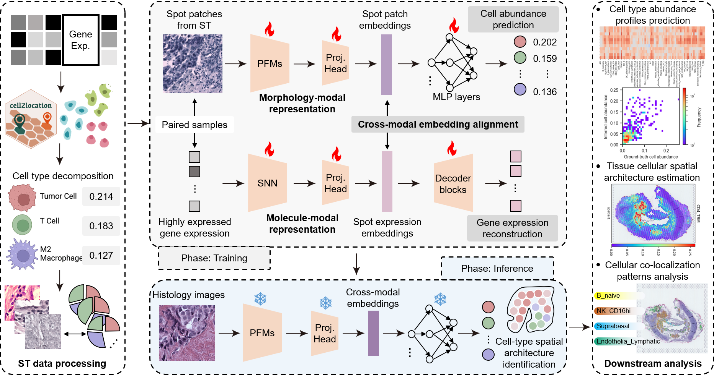
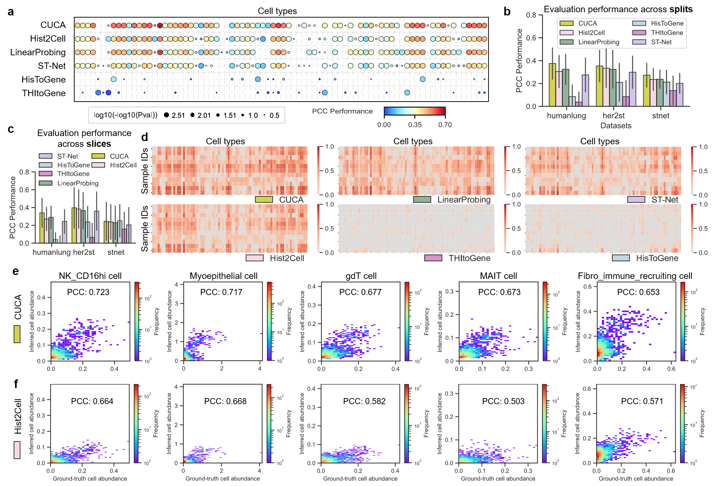

# CUCA: Predicting fine-grained cell types from histology images through cross-modal learning in spatial transcriptomics

> [**Predicting fine-grained cell types from histology images through cross-modal learning in spatial transcriptomics**]() <br>
> Chaoyang Yan, Zhihan Ruan, Yichen Pan, Xue Han, Songkang Chen, Yuanyu Li, and Jian Liu*. <br>
> Centre for Bioinformatics and Intelligent Medicine, College of Computer Science, Nankai University <br>
> Submitted to ISMB/ECCB 2025 <br>


<!--  -->


## WHY and WHAT WE DO   
<details>
  <summary>
	  <b>Motivation</b>
  </summary>

Fine-grained cellular characterization provides critical insights into biological processes, including tissue development, disease progression, and treatment responses. 
The spatial organization of cells and the interactions among distinct cell types play a pivotal role in shaping the tumor micro-environment, driving heterogeneity, and significantly influencing patient prognosis.

While computational pathology can uncover morphological structures from tissue images, conventional methods ([hover_net](https://github.com/vqdang/hover_net), [CellViT](https://github.com/TIO-IKIM/CellViT), ..) are often restricted to identifying coarse-grained and limited cell types. 

In contrast, spatial transcriptomics-based approaches hold promise for pinpointing fine-grained transcriptional cell types using histology data. However, these methods ([Hist2Cell](https://github.com/Weiqin-Zhao/Hist2Cell), [STASCAN](https://github.com/AbbyWY/STASCAN), ..) tend to overlook key molecular signatures inherent in gene expression data.
</details>


<details>
  <summary>
	  <b>Key Ideas & Main Findings</b>
  </summary>

1. A cross-modal unified representation learning framework (CUCA) is proposed for identifying fine-grained cell types from histology images. 
CUCA is trained on paired morphology-molecule spatial transcriptomics data, enabling it to infer fine-grained cell abundances solely from pathology images.

2. The cross-modal embedding alignment paradigm is designed to harmonize the embedding spaces of morphological and molecular modalities, bridging the gap between image patterns and molecular expression signatures.

3. Extensive results across three datasets show that CUCA captures molecule-enhanced cross-modal representations and improves the prediction of fine-grained transcriptional cell abundances.

4. Downstream analyses of cellular spatial architectures and intercellular co-localization reveal that CUCA provides insights into tumor biology, offering potential advancements in cancer research.

</details>


<!-- ## 1. Capability of CUCA in predicting fine-grained cell abundances
CUCA shows the highest correlation with ground truth labels, achieving average Pearson correlation coefficient of 0.375 across all 80 fine-grained cell types for the humanlung dataset, and PCC values of 0.353 and 0.273 among 39 cell types for the her2st and stnet datasets, respectively.




## 2. Capability of CUCA in resolving cellular spatial architectures
CUCA is capable of resolving fine-grained cellular spatial architectures from histology images, and it effectively showcases local patterns, such as cell density, and global characteristics (cell localization trends) of cellular spatial distribution.


## 3. Capability of CUCA in elucidating cell-type co-localization patterns
intercellular co-localization pattern analysis reveals that CUCA provides valuable insights into investigating the key interactions and the global co-localization patterns among fine-grained cell type pairs.

 -->


# User Guide

## 1. Requirements and installation

### Operating systems

The codes have been implemented on Ubuntu 22.04 LTS. The installation in other operation systems (Windows or MAC) should be cautious due to python packages.

### Packages and version

The packages required have been provided in the file [environment.yml](environment.yml)

### Installation

<!-- CUCA is implemented by Python 3.9 and PyTorch 2.4.1  -->
To install the environment, you can run the command in the terminal:

```shell
conda env create -f environment.yml
conda activate cuca
```

OR

✨ You can use the Docker image for a streamlined setup. The Dockerfile is provided [HERE](Dockerfile). Simply build and run the image to get started.


## 2. Data 

All data used in this work are publicly available. 

- The healthy lung dataset derived from the integrated Human Lung Cell Atlas can be obtained from the public domain: [https://5locationslung.cellgeni.sanger.ac.uk/](https://5locationslung.cellgeni.sanger.ac.uk/).

- The her2st data is available in Zenodo, at [https://doi.org/10.5281/zenodo.4751624](https://doi.org/10.5281/zenodo.4751624). 

- The stnet data is available in Mendeley Data at [https://data.mendeley.com/datasets/29ntw7sh4r/5](https://data.mendeley.com/datasets/29ntw7sh4r/5).

**FYI**: For convenience, you can also refer to [Processed data from Hist2Cell](https://connecthkuhk-my.sharepoint.com/:f:/g/personal/wqzhao98_connect_hku_hk/Eiq-wLB0Pt5FjF9evrr2HEIBpZQYxoQXgytf0bjNsZN2LQ?e=v89Ulr).


The data was uploaded in compressed format via Onedrive, please download the data and unzip them using `tar -xzvf` command.

Remember to download all datasets into the folder `example_data` for the following operations.

## 3. Preparation for pathology foundation models 

Pre-trained **Virchow2** foundation model can be found at [https://huggingface.co/paige-ai/Virchow2](https://huggingface.co/paige-ai/Virchow2)

You can apply more foundation models (['gigapath'](https://github.com/prov-gigapath/prov-gigapath), ['H-optimus-0'](https://github.com/bioptimus/releases/tree/main/models/h-optimus/v0), ['phikon'](https://github.com/owkin/HistoSSLscaling), ['virchow'](https://huggingface.co/paige-ai/Virchow), ['UNI'](https://github.com/mahmoodlab/UNI), ...) as we did in the ablation study. 

You need to `mkdir model_weights_pretrained/` and put these pretrained models into `model_weights_pretrained/`.

## 4. Train, Evaluation and Inference

The cross-val split files for three datasets can be found in [**cross_val_splits/**](cross_val_splits/) 

### CUCA model training

We prepare the experiment bash scripts, you can run the code directly. 

```shell
sh run_CUCA.sh # write train-logs to the local.
```

or

```shell
CUDA_VISIBLE_DEVICES=0 python main.py -c cfgs/cfgs_lung.yaml    --opts CKPTS exp_code exp_reproduce
CUDA_VISIBLE_DEVICES=0 python main.py -c cfgs/cfgs_her2st.yaml  --opts CKPTS exp_code exp_reproduce
CUDA_VISIBLE_DEVICES=0 python main.py -c cfgs/cfgs_stnet.yaml   --opts CKPTS exp_code exp_reproduce
```


`cfgs/cfgs_{dataset}.yaml` in [**cfgs/**](cfgs/) contains the config hyper-parameters for model training [HERE](#parameter-configs). 

**NOTING**: Users can also observe loss curves and changes in indicators in **Browser (eg. localhost:6006)** during model training by **tensorboard**.

```python
cd ${results_dir}${dataset}${exp_code}
tensorboard --logdir . --port=<your port, eg. 6006>
```


### Parameter configs

A hyper-parameters-configured example for **her2st dataset** is given below

```YAML
CKPTS:
  exp_code:         exp_reproduce                 # experiment code
  data_root:        example_data/her2st           # data directory containing the raw data for each task
  split_data_root:  cross_val_splits/her2st       # directory containing the split files for each dataset
  split_ids:        [0, 1, 2, 3]                  # split ids used for training
  results_dir:      results                       # directory where results will be dumped
  independent_root:                               # directory containing the independent test data
  independent_list:                               # list of independent test sets

HyperParams:
  max_epochs: 100           # maximum number of epochs to train (default: 100)
  batch_size: 128           # input batch size for training (default: 128)
  num_workers: 16           # data loader workers (default: 16)
  lr_rate: 0.002            # learning rate (default: 0.002)
  optim_fn: adam            # optimizer [adam, sgd, rmsprop, adadelta, adagrad, adamw]
  weight_reg: 0.0001        # weight decay (default: 1e-4)
  scheduler_fn: OneCycleLR  # optimizer scheduler [CosineAnnealingLR CyclicLR LinearLR OneCycleLR StepLR, or none]

  loss_main:  RMSE          # balanceMSE # ['RMSE', 'MSE', 'CE', 'L1', 'Pearson'] ' loss function (default: RMSE)'
  loss_rec:   RMSE          # balanceMSE # ['RMSE', 'MSE', 'CE', 'L1', 'Pearson'] ' loss function (default: RMSE)'
  loss_align: RMSE          # balanceMSE # ['RMSE', 'MSE', 'CE', 'L1', InfoNCE] ' loss function (default: RMSE)'
  lambda_main:  0.3         # lambda weight for main pred loss (default: 0.3)
  lambda_rec:   0.6         # lambda weight for reconstruction loss (default: 0.6)
  lambda_align: 0.1         # lambda weight for cross-modal alignment loss (default: 0.1)

  pre_extracted: False      # use pre-extracted features or not (default: False)
  architecture: CUCA        # CUCA, CUCAMLP, hist2cell, FMMLP, MLP
  backbone:     virchow2    # virchow2, virchow  ...
  hidden_dim: 512           # hidden dimension for the model
  proj_dim:   512           # projection dimension for the model
  num_cls:    39            # number of classes for the model


LoraCfgParams:       
  ft_lora: True                   # whether to use lora or not
  r: 8                            # dimensions of a low-rank matrix
  lora_alpha: 16                  # alpha parameter in lora
  target_modules: []              # target modules for lora
  lora_dropout: 0.1               # dropout for lora
  bias: 'none'                    # bias for lora
  modules_to_save:                
  only_spec_blocks: ["30", "31"]  # uni_v1: ["22", "23"], virchow2: ["30", "31"], hoptimus0: ["38", "39"]


COMMON:
  gpu: '0'
  seed: 3407                      # 'random seed for reproducible experiment (default: 3407)'

```

You can also set your own configs with the comment guidance.


### Comparative models training

We prepare the comparative experiment bash scripts, you can also execute the shell scripts. 

```shell
sh run_${comparative_methods}.sh # write train-logs to the local.
```
where `comparative_methods` are the methods including `hist2cell`, `HisToGene`, `STNet`, and `THItoGene`.

```shell
sh run_CUCA-fixedFM.sh # write train-logs to the local.
```
was the experiment that fixed the weight parameters in the foundation models for predicting fine-grained cell types.


### Evaluation

The training scripts above will generate the evaluated quantitative results into their corresponding `training.log`.

We also implemented a script for individual quantitative evaluation into `csv` result files. We reported these results in our paper. You can execute it by modifying the specific config parameters.

```shell
CUDA_VISIBLE_DEVICES=0 python test_evaluation_JSD.py -ep ${results_dir}/${dataset}/${exp_code}
CUDA_VISIBLE_DEVICES=0 python test_evaluation_spearmanr.py -ep ${results_dir}/${dataset}/${exp_code}
CUDA_VISIBLE_DEVICES=0 python test_evaluation.py -ep ${results_dir}/${dataset}/${exp_code}

```


### Trained models weights

The pre-trained weights of our model on the humanlung, her2st, and stnet datasets can be downloaded in [HERE](https://pan.baidu.com/s/12PI4It5iOSuvXiaitLe7oQ?pwd=vwxc). The weights can be used to reproduce the results in our paper. Also, It has the capability of inferring on new H&E histology images.


## Contact

If you have any problems, just raise an issue in this repo.


## Acknowledgements

Part of the code is borrowed from [Hist2Cell](https://github.com/Weiqin-Zhao/Hist2Cell) and [HEST](https://github.com/mahmoodlab/HEST). (Cheers to the community as well)

If you find our work useful in your research, please consider citing our work and giving this repo a star. Thank you~

<!-- ```
@article{10.1093/bioinformatics/btae236,
    author = {Yan, Chaoyang and Sun, Jialiang and Guan, Yiming and Feng, Jiuxin and Liu, Hong and Liu, Jian},
    title = "{PhiHER2: phenotype-informed weakly supervised model for HER2 status prediction from pathological images}",
    journal = {Bioinformatics},
    volume = {40},
    number = {Supplement_1},
    pages = {i79-i90},
    year = {2024},
    month = {06},
    issn = {1367-4811},
    doi = {10.1093/bioinformatics/btae236},
    url = {https://doi.org/10.1093/bioinformatics/btae236},
    eprint = {https://academic.oup.com/bioinformatics/article-pdf/40/Supplement\_1/i79/58354990/btae236.pdf},
}

``` -->
